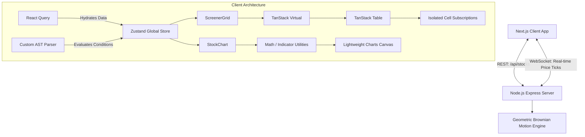

# Real-Time Stock Screener & Simulator

A high-performance, real-time stock screener application built with Next.js, React, and Zustand. It features a custom Abstract Syntax Tree (AST) query engine for complex filtering, WebGL-powered lightweight charting, and an optimized virtualization architecture capable of rendering 5000+ live-updating stocks at 60 FPS without dropping frames.

 *(Placeholder for screenshot)*

## 🏗️ Architecture

The application is structured into a dedicated Node.js backend simulating market data using Geometric Brownian Motion, and a highly optimized Next.js client.

### Component & Data Flow Diagram



## 🚀 Setup Instructions

Follow these step-by-step instructions to get the project running locally.

**1. Clone the repository**
```bash
git clone <repository-url>
cd p1
```

**2. Start the Backend Simulation Server**
The backend runs on port `3001` and serves both the REST API and the WebSocket server.
```bash
cd server
npm install
npm run dev
```

**3. Start the Frontend Client**
Open a new terminal window. The frontend runs on port `3000` (or `3001` depending on Next.js defaults) and proxies requests to the backend.
```bash
cd client
npm install --legacy-peer-deps
npm run dev
```
Navigate to `http://localhost:3000` in your browser.

## 🔑 Environment Variables

The project is designed to run completely offline/locally out-of-the-box and does **not** require mandatory `.env` configurations. 

If necessary, you can configure the backend port in the `server` directory:
- `PORT` (Default: `3001`) - The port the Node.js Express server listens on.

## 📜 Available Scripts

### Client (`/client`)
- `npm run dev`: Starts the Next.js development server.
- `npm run build`: Compiles the production build.
- `npm run test`: Runs the Vitest test suite.
- `npm run test:coverage`: Runs tests and generates a code coverage report (`>70%`).
- `npm run lint`: Runs ESLint for code quality checks.
- `npm run storybook`: Starts the isolated Storybook component development environment on port `6006`.
- `npm run build-storybook`: Compiles a static production version of Storybook.

### Server (`/server`)
- `npm run dev`: Starts the simulation backend using `tsx` with hot module replacement.
- `npm run build`: Compiles TypeScript to JavaScript into the `dist/` directory.
- `npm run start`: Runs the compiled production server.

## 🛠️ Technology Decisions & Trade-offs

- **Zustand over Redux/Context**: Chosen for its minimalistic API and support for highly localized component re-rendering. Instead of wrapping the `ScreenerGrid` in a global context, individual components like `PriceCell` use selector subscriptions. This prevents the parent grid from re-rendering every time a stock ticks.
- **TanStack Virtual**: Essential for performance. The DOM only renders the ~20 visible rows instead of all 5000 stocks, massively reducing browser layout calculations and memory usage.
- **Custom AST Query Parser**: We wrote a custom recursive descent Abstract Syntax Tree (AST) parser to evaluate filters locally. 
  - *Trade-off*: Evaluating 5000 rules consumes client CPU cycles, but provides an instantaneous, zero-latency UX compared to hitting a remote SQL server for every keystroke.
- **Lightweight Charts (Canvas/WebGL)**: Chosen over SVG-based solutions like Recharts or Chart.js because SVG rendering degrades drastically past a few hundred data points. Canvas charting easily manages historic data + Bollinger Bands, SMA, and EMA indicators natively.
- **Isolated Storybook Integration**: UI primitives and generic cell renderers are extracted so they can be independently tested and visualized offline without having to mock the entire WebSocket infrastructure.

## 🚧 Known Limitations & Future Improvements

1. **WebSocket Scaling**: The current Node.js server synchronously broadcasts ticks via `ws`. While this is highly efficient locally, it could become a bottleneck past thousands of concurrent client connections. 
   - *Future*: Migrate to a Redis Pub/Sub architecture for horizontal scaling.
2. **Initial Payload Size**: The frontend fetches the entire 5000 stock list initially. While the grid handles rendering this easily, the initial JSON payload is large (~3MB).
   - *Future*: Implement binary protocols like Protobuf or WebSocket streams with compression.
3. **Mobile Responsiveness for Charts**: While the grid and filter panel adjust to mobile viewports, manipulating advanced Canvas charts (drawing lines, dragging to zoom) is notoriously difficult on touch devices.
   - *Future*: Create a simplified, touch-optimized chart view exclusively for mobile users.
